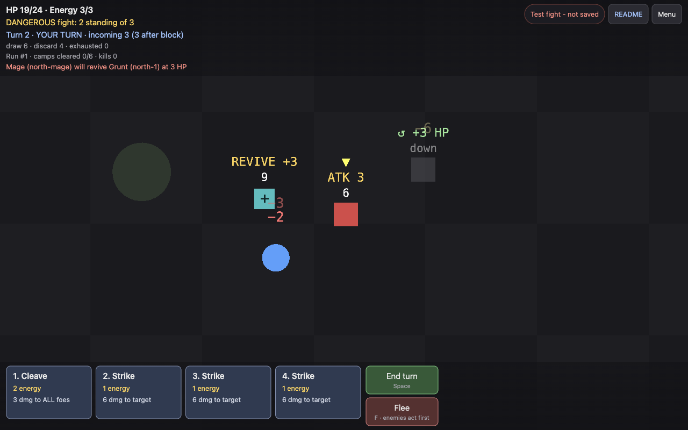
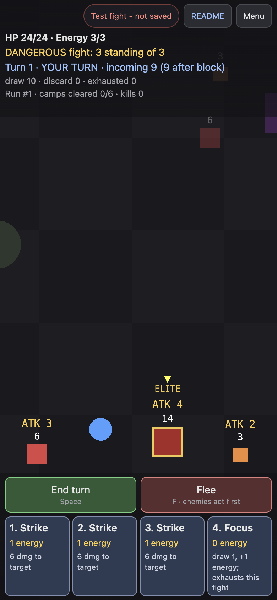

# Camp Clearer

A small card-battle trek for a handful of friends: walk the map, choose which
enemies to pull into each fight, read their next move, and play your hand.
Your run is kept on the server for your browser, no account needed.

## Who it's for

People who like a short tactics puzzle (Slay the Spire, Into the Breach) and
have ten minutes on a laptop or phone. They want to stop mid-run and pick it
up later, and not be hurried while they think.

## What good means here

**Enforced** means a test fails if it breaks; **judged** means I check it by playing.

1. **Thinking is free.** Nothing happens during your turn until you end it: no
   timers, no regeneration, no enemy moves. *Enforced:* `src/turn.test.ts`,
   `src/combat.test.ts` and a browser check.
2. **You choose the size of every fight.** Lone enemies notice you one at a
   time, so you can split them; a pack (outlined, named on the ground)
   wakes, chases and joins together. *Enforced:* `src/encounter.test.ts`.
   *Judged:* whether it feels predictable.
3. **Every enemy's next move is readable,** with real numbers: who a mage
   will revive, what a charge leads to. Nothing overlaps at 1920x1080 or
   390x844; big fights use a side list instead of shrinking. *Enforced:*
   `src/combat.test.ts`, `src/formation.test.ts`.
4. **Each enemy changes your plan.** Swarmlings reward Cleave, a mage makes
   you choose between it and its grunts, a captain's charge is the time to
   Guard. *Judged* in play; `tools/balance.ts hand` shows a bot playing one
   hand differently against each group.
5. **Fleeing is honest.** Enemies still take their shown actions before you
   escape, and elites remember their charge. *Enforced:* phase and combat
   tests.
6. **Cards never vanish.** The 14-card deck is conserved across draw, hand,
   discard and this fight's exhaust pile. *Enforced:* `src/cards.test.ts`,
   including 300 random fights.
7. **Your run is still there tomorrow.** The server saves a checkpoint when a
   fight starts and after you win, flee or fall. "Saved" appears only after
   the server confirms, a run's final result is saved before the next run
   starts, and a killed enemy can't come back. *Enforced:* `src/net.test.ts`,
   `spec/saves.test.ts`, and `tools/persistence-check.sh` (restart, rebuild).
8. **A phone is a full controller.** Tap to move, tap enemies and cards, with
   text that stays readable. *Judged, with checks:* `tools/playtest.mjs`
   plays with touch at 390x844.

## This version

You can explore six camps, fight, flee, die, and come back to a restored
run. Closing the tab mid-fight returns you to when that fight started. Starting a new run keeps the old one in your history; only "Erase my
saved data", confirmed by typing ERASE, deletes anything.

Not built yet: anything shared between players (crit 9), accounts, loot,
talents and art.

## Where these ideas came from

**My playtests.** v1 let me move during combat, and it felt like an action
grinder rather than a card game. Locking movement in fights fixed that, but
real-time enemy attacks then punished reading the hand, so combat became
strict turns. Crowding made bodies and intents overlap, which led to the
formation step. Each fix is now a rule or a test above.

**What I read.**

- Robin Sloan, [An app can be a home-cooked meal](https://www.robinsloan.com/notes/home-cooked-app/):
  software for a few known people can skip accounts. Here that became
  anonymous cookie saves.
- [Slay the Spire's development](https://en.wikipedia.org/wiki/Slay_the_Spire):
  without telegraphed enemy actions, playtesters were "confused about the
  number of card abilities without any clear situation to apply them", so
  Mega Crit added Intents. Promise 3 comes from this.
- Justin Ma on [Into the Breach](https://www.gamedeveloper.com/game-platforms/road-to-the-igf-subset-games-i-into-the-breach-i-):
  telegraphing so "every death felt like your own fault". That is why
  fleeing still resolves the shown attacks.
- [WCAG 2.2 Target Size (Minimum)](https://www.w3.org/WAI/WCAG22/Understanding/target-size-minimum.html):
  the 24px floor I hold the phone controls well above.
